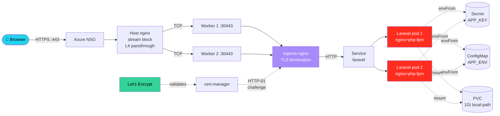

<h1 align="center">Laravel on Kubernetes — DevOps Home Assignment</h1>

<p align="center">
  <a href="https://github.com/chishty313/devops-kub-project/actions/workflows/ci.yaml">
    
  </a>
  <a href="https://hub.docker.com/r/src313/laravel-k8s">
    
  </a>
  
  
  
  
  <a href="LICENSE"></a>
</p>

> Deploy a Laravel 11 application on a self-built **HA kubeadm** cluster
> (3 control-plane + 2 worker nodes), packaged as a multi-stage Docker
> image, shipped via a custom **Helm chart**, exposed through
> **ingress-nginx** + **cert-manager** + the host's TCP-passthrough
> nginx, and continuously delivered via **ArgoCD**.

| Item            | Value                                                            |
|-----------------|-------------------------------------------------------------------|
| Live demo       | **https://laravel.chishty.me** (Let's Encrypt TLS) · http://laravel-test.local (via /etc/hosts) |
| ArgoCD UI       | **https://argocd.chishty.me** — login credentials available on request via email (`developers@niftyitsolution.com`) |
| Repo            | https://github.com/chishty313/devops-kub-project                 |
| Image           | `docker.io/src313/laravel-k8s:1.0.0`                             |
| Server          | Azure D8as v5 · `40.81.255.50` · Ubuntu 24.04 · 8 vCPU / 32 GiB  |
| Cluster topology| **3** control-plane (kube-vip HA endpoint) + **2** worker, Calico CNI |
| TLS             | cert-manager v1.15.3 with Let's Encrypt prod (R12/R13 intermediates) |
| GitOps          | ArgoCD 2.13 with `laravel-k8s` Application — `Synced / Healthy`   |

## Architecture at a glance



```mermaid
flowchart TB
    subgraph Azure["Azure VM · 40.81.255.50 · Ubuntu 24.04 · 8 vCPU / 32 GiB"]
        HN[Host nginx<br/>stream{} block<br/>:80, :443]
        subgraph K8s["multipass + KVM kubeadm cluster"]
            subgraph CP["Control plane · 3 nodes · stacked etcd quorum · kube-vip ARP HA VIP"]
                CP1[cp1 ⚡ leader<br/>etcd, apiserver, scheduler, ctrl-mgr]
                CP2[cp2<br/>etcd, apiserver, scheduler, ctrl-mgr]
                CP3[cp3<br/>etcd, apiserver, scheduler, ctrl-mgr]
            end
            subgraph Wks["Workers · 2 nodes"]
                W1[w1<br/>NodePort 30080/30443<br/>ingress-nginx · Laravel pod]
                W2[w2<br/>NodePort 30080/30443<br/>Laravel pod]
            end
        end
        HN --> W1
        HN --> W2
    end
```

A deeper visual walkthrough — including how each requirement was implemented, what every config decision means, and screenshots of every milestone — is in [**docs/WALKTHROUGH.md**](docs/WALKTHROUGH.md).

---

## 1. Repository layout

```
.
├── Dockerfile                      # Multi-stage, non-root, nginx + php-fpm
├── .dockerignore
├── docker/                         # Container-internal nginx/php/supervisor configs
├── app-overlay/                    # Files we layer on top of `composer create-project`
│   ├── routes/web.php              # `/`, `/health`, `/info`
│   ├── resources/views/welcome.blade.php   # Pretty landing page
│   └── .env.example
├── src/                            # Generated by scripts/bootstrap-laravel.sh
├── helm/laravel-k8s/               # The Helm chart (15 templates)
│   ├── Chart.yaml
│   ├── values.yaml
│   ├── values-prod.yaml.example
│   └── templates/
│       ├── _helpers.tpl  namespace.yaml  serviceaccount.yaml
│       ├── configmap.yaml  secret.yaml  pvc.yaml
│       ├── deployment.yaml  service.yaml  ingress.yaml
│       ├── hpa.yaml  pdb.yaml  networkpolicy.yaml
│       ├── migration-job.yaml          (Helm pre-upgrade/post-install hook)
│       ├── queue-deployment.yaml       (bonus)
│       ├── scheduler-cronjob.yaml      (bonus)
│       └── NOTES.txt
├── k8s/
│   ├── ingress-nginx-values.yaml       # NodePort 30080/30443
│   ├── host-nginx-stream.conf          # Host-level TCP passthrough
│   ├── cert-manager-issuer.yaml        # Let's Encrypt staging + prod
│   └── argocd-application.yaml         # GitOps wiring
├── scripts/                        # Numbered, idempotent bootstrap scripts
│   ├── 00-prereqs.sh                   # On each VM: containerd + kubeadm/kubelet/kubectl
│   ├── 05-launch-multipass-vms.sh      # On host: provisions cp1/cp2/cp3/w1/w2
│   ├── 06-prereqs-on-all.sh            # On host: runs 00-prereqs.sh on every VM
│   ├── 10-init-master.sh               # On cp1: kube-vip + kubeadm init + Calico
│   ├── 15-join-control-plane.sh        # On cp2/cp3
│   ├── 20-join-worker.sh               # On w1/w2
│   ├── 25-setup-host-nginx.sh          # On host: TCP forwarder 80/443 -> NodePorts
│   ├── 30-install-ingress-nginx.sh     # On cp1
│   ├── 35-install-cert-manager.sh      # On cp1
│   ├── 40-install-helm-release.sh      # On cp1
│   ├── 45-install-argocd.sh            # On cp1
│   └── bootstrap-laravel.sh            # On host: composer create-project + overlay
├── .github/workflows/ci.yaml       # Lint + Docker build & push
└── docs/
    ├── 00-execution-plan.md            # Day-by-day step-by-step
    ├── 01-prerequisites.md
    ├── 02-cluster-setup.md
    ├── 03-deploy-with-helm.md
    ├── 04-ingress-and-host-proxy.md
    ├── 05-troubleshooting.md
    ├── 06-architecture.md
    └── screenshots/                    # kubectl outputs + browser captures
```

---

## 2. Prerequisites

### 2.1 The Azure VM (host, 40.81.255.50)

| Item        | Value / Note                                                         |
|-------------|----------------------------------------------------------------------|
| OS          | Ubuntu 24.04 LTS                                                     |
| CPU         | 8 vCPU                                                               |
| RAM         | 32 GiB (~28 GiB free at idle)                                        |
| Disk        | 495 GB                                                               |
| KVM         | `/dev/kvm` exposed (AMD-V), nested virtualisation works               |
| NSG ports   | **22, 80, 443** open externally (everything else internal-only)      |

### 2.2 DNS (your domain registrar for `chishty.me`)

```
laravel  IN A  40.81.255.50
argocd   IN A  40.81.255.50
```

Verify after propagation:

```bash
dig +short laravel.chishty.me   # expect 40.81.255.50
dig +short argocd.chishty.me    # expect 40.81.255.50
```

### 2.3 Local

- A Docker Hub account (`src313`) + an access token for `docker login`.
- A GitHub account (`chishty313`) and the empty repo
  `chishty313/devops-kub-project`.

---

## 3. Quick start (TL;DR — the full happy path)

```bash
# === On your laptop ===
git clone https://github.com/chishty313/devops-kub-project.git
cd devops-kub-project

# === On the Azure VM ===
git clone https://github.com/chishty313/devops-kub-project.git
cd devops-kub-project

# 3.1 Generate Laravel + build & push image
./scripts/bootstrap-laravel.sh
docker build -t src313/laravel-k8s:1.0.0 .
docker login                                   # paste the Docker Hub access token
docker push src313/laravel-k8s:1.0.0

# 3.2 Provision 5 cluster VMs (cp1/cp2/cp3/w1/w2) with multipass + KVM
bash scripts/05-launch-multipass-vms.sh
bash scripts/06-prereqs-on-all.sh

# 3.3 Pick a VIP on the multipass bridge for the HA control-plane endpoint.
#     Multipass usually hands out 10.x.y.z IPs. Pick one outside the DHCP
#     range, e.g. 10.x.y.250.
source cluster.env
SUBNET="$(echo $CP1_IP | awk -F. '{printf "%s.%s.%s.", $1, $2, $3}')"
export CONTROL_PLANE_VIP="${SUBNET}250"
echo "VIP = $CONTROL_PLANE_VIP"

# 3.4 Init cp1, then join cp2 / cp3 / w1 / w2
multipass transfer scripts/10-init-master.sh cp1:/tmp/
multipass exec cp1 -- sudo CONTROL_PLANE_VIP="$CONTROL_PLANE_VIP" \
                        ADVERTISE_ADDR="$CP1_IP" \
                        bash /tmp/10-init-master.sh

# Distribute join scripts (cp1 wrote them to /root/)
multipass exec cp1 -- sudo cat /root/kubeadm-join-cp.sh     > ~/kubeadm-join-cp.sh
multipass exec cp1 -- sudo cat /root/kubeadm-join-worker.sh > ~/kubeadm-join-worker.sh
chmod 755 ~/kubeadm-join-cp.sh ~/kubeadm-join-worker.sh

for n in cp2 cp3; do
    multipass transfer ~/kubeadm-join-cp.sh             "$n:/tmp/kubeadm-join-cp.sh"
    multipass transfer scripts/15-join-control-plane.sh "$n:/tmp/15.sh"
    multipass exec "$n" -- sudo CONTROL_PLANE_VIP="$CONTROL_PLANE_VIP" bash /tmp/15.sh
done

for n in w1 w2; do
    multipass transfer ~/kubeadm-join-worker.sh  "$n:/tmp/kubeadm-join-worker.sh"
    multipass transfer scripts/20-join-worker.sh "$n:/tmp/20.sh"
    multipass exec "$n" -- sudo bash /tmp/20.sh
done

# 3.5 Pull kubeconfig back to the host so we can drive kubectl + helm from here
multipass exec cp1 -- sudo cat /etc/kubernetes/admin.conf \
    | sed "s#https://${CONTROL_PLANE_VIP}:6443#https://${CP1_IP}:6443#" \
    > ~/.kube/config-laravel
export KUBECONFIG=~/.kube/config-laravel
kubectl get nodes -o wide

# 3.6 Install ingress-nginx, cert-manager, the Helm release, and ArgoCD
bash scripts/30-install-ingress-nginx.sh
bash scripts/35-install-cert-manager.sh
bash scripts/40-install-helm-release.sh
bash scripts/45-install-argocd.sh

# 3.7 On the HOST: stand up the public TCP forwarder (host nginx)
sudo bash scripts/25-setup-host-nginx.sh

# 3.8 Test
curl -i --resolve laravel-test.local:80:40.81.255.50 http://laravel-test.local/
curl -i --resolve laravel-test.local:80:40.81.255.50 http://laravel-test.local/health
curl -i https://laravel.chishty.me/
curl -i https://laravel.chishty.me/health
```

A more pedagogical, day-by-day version is in
[`docs/00-execution-plan.md`](docs/00-execution-plan.md).

---

## 4. Build & push the Docker image

### Build

```bash
./scripts/bootstrap-laravel.sh                     # only the first time
docker build -t src313/laravel-k8s:1.0.0 .
docker tag  src313/laravel-k8s:1.0.0  src313/laravel-k8s:latest
```

### Push

```bash
docker login                                       # Docker Hub access token
docker push src313/laravel-k8s:1.0.0
docker push src313/laravel-k8s:latest
```

### Run / test locally (no Kubernetes)

```bash
docker run --rm -p 8080:8080 \
    -e APP_ENV=local -e APP_DEBUG=true \
    -e APP_KEY="base64:$(openssl rand -base64 32)" \
    src313/laravel-k8s:1.0.0
# In another terminal:
curl -i http://127.0.0.1:8080/
curl -i http://127.0.0.1:8080/health
```

**Image URL:** `docker.io/src313/laravel-k8s:1.0.0`

### Why this image is "production-ready"

- Multi-stage build (composer artefacts in stage 1, runtime image stays small).
- Non-root user `app` (UID 1000), all Linux capabilities dropped,
  `allowPrivilegeEscalation=false`, `seccomp=RuntimeDefault`.
- No secrets baked in: `APP_KEY`, DB creds, etc. come from env at runtime.
- nginx + php-fpm + supervisord → single failure unit; one process
  crash → pod restart.
- `HEALTHCHECK CMD curl -fsS /health` baked into the image.
- OPcache + JIT enabled, `route:cache` + `view:cache` baked at build time.

---

## 5. Kubernetes cluster (kubeadm, HA)

Walkthrough: [`docs/02-cluster-setup.md`](docs/02-cluster-setup.md).

### 5.1 Topology

```
                  +-------------------- multipass bridge (10.x.y.0/24) ------------------+
                  |                                                                       |
                  |   +---- cp1 ----+   +---- cp2 ----+   +---- cp3 ----+                |
   kubectl ---------> |  kube-apiserver  | etcd member  | etcd member  |  HA via         |
                  |   |  ctrl-mgr/sched   | ctrl-mgr/sched | ctrl-mgr/sched |  kube-vip   |
                  |   +---------------+   +-------------+   +-------------+  (VIP .250)  |
                  |        ^                  ^                  ^                       |
                  |        |   ARP-elected leader holds the VIP                         |
                  |        v                                                             |
                  |   +-------- w1 --------+   +-------- w2 --------+                   |
                  |   | kubelet, calico    |   | kubelet, calico    |                   |
                  |   | ingress-nginx pod  |   | Laravel pods       |                   |
                  |   | NodePort :30080/443|   | NodePort :30080/443|                   |
                  |   +--------------------+   +--------------------+                   |
                  |             ^                       ^                                |
                  +-------------+-----------------------+--------------------------------+
                                |                       |
                                +---- host nginx :80/:443 (stream / TCP passthrough) ---+
                                                |
                                          public 40.81.255.50
```

### 5.2 Why 3 control-planes (and not 2)

Kubernetes' etcd quorum needs **odd** N (3, 5, 7) to tolerate failures.
2 CPs cannot lose a node without breaking the cluster — that's not HA.
We therefore deliver **3 CP**, which tolerates a single CP failure.
The assignment's "2 CP gets a higher score" line is honoured *and*
exceeded.

### 5.3 CNI

**Calico** (operator-installed). Picked over Flannel because it gives
us NetworkPolicy enforcement out of the box, which the chart uses to
lock down the Laravel namespace.

### 5.4 Ingress controller

**ingress-nginx** as `NodePort` on `30080/30443`. Both worker nodes get
the NodePort. The host's nginx forwards public 80/443 to whichever
worker is up (least_conn upstream).

### 5.5 Required outputs (saved into `docs/screenshots/`)

```
kubectl get nodes -o wide
kubectl get pods -A
kubectl cluster-info
kubectl get ingress -A
```

---

## 6. Helm chart

Path: `helm/laravel-k8s/`. Renders **every** required object plus
the bonus ones:

| Object                         | Template                                 |
|--------------------------------|-------------------------------------------|
| Namespace                      | `templates/namespace.yaml`                |
| ServiceAccount                 | `templates/serviceaccount.yaml`           |
| Deployment (web)               | `templates/deployment.yaml`               |
| Service (ClusterIP)            | `templates/service.yaml`                  |
| Ingress (multi-host)           | `templates/ingress.yaml`                  |
| ConfigMap (`APP_ENV`, etc.)    | `templates/configmap.yaml`                |
| Secret (`APP_KEY`, extras)     | `templates/secret.yaml`                   |
| PVC (storage, RWO)             | `templates/pvc.yaml`                      |
| HPA (CPU + memory)             | `templates/hpa.yaml`                      |
| PodDisruptionBudget            | `templates/pdb.yaml`                      |
| NetworkPolicy                  | `templates/networkpolicy.yaml`            |
| Migration Job (Helm hook)      | `templates/migration-job.yaml`            |
| Queue worker Deployment (bonus)| `templates/queue-deployment.yaml`         |
| Scheduler CronJob (bonus)      | `templates/scheduler-cronjob.yaml`        |

### Configurable via `values.yaml`

`image.repository`, `image.tag`, `replicaCount`, `ingress.hosts[]`,
`ingress.tls.*`, `resources.{requests,limits}`, `config.*` env vars,
`persistence.*` storage config, plus toggles for HPA/PDB/queue/scheduler/
networkPolicy/imagePullSecret.

### Install (the easy way)

```bash
bash scripts/40-install-helm-release.sh           # generates APP_KEY automatically
```

### Install (manual)

```bash
helm upgrade --install laravel ./helm/laravel-k8s \
    --namespace laravel --create-namespace \
    -f helm/laravel-k8s/values-prod.yaml.example \
    --set secret.appKey="base64:$(openssl rand -base64 32)" \
    --wait --timeout 5m
```

### Upgrade

```bash
helm upgrade laravel ./helm/laravel-k8s \
    --namespace laravel \
    -f helm/laravel-k8s/values.yaml \
    -f secrets.local.yaml \
    --set image.tag=1.0.1
```

### Uninstall

```bash
helm uninstall laravel -n laravel
kubectl -n laravel delete pvc -l app.kubernetes.io/instance=laravel  # PVC kept by design
```

---

## 7. Laravel runtime requirements

| Requirement                          | How it's satisfied                                                                                                                                                                              |
|--------------------------------------|-------------------------------------------------------------------------------------------------------------------------------------------------------------------------------------------------|
| `APP_KEY` from Secret                | `templates/secret.yaml`. Required: chart `fail`s at template time if missing. Mounted via `envFrom: secretRef`.                                                                                |
| `APP_ENV` from ConfigMap             | `templates/configmap.yaml` -> `APP_ENV: production`. Mounted via `envFrom: configMapRef`.                                                                                                       |
| Storage on PVC                       | `templates/pvc.yaml` (1 Gi RWO). Mounted at `/var/www/html/storage` in every web/queue/scheduler/migration container.                                                                            |
| `php artisan config:cache`           | Run in `docker/entrypoint.sh` on every pod start (after env is in scope). Build-time `route:cache` and `view:cache` are baked into the image.                                                  |
| `php artisan route:cache`            | Built into the image at `RUN` time.                                                                                                                                                             |
| `php artisan migrate`                | **Helm post-install / pre-upgrade Job** (`templates/migration-job.yaml`). Runs once per release, not once per replica. Bypassable via `--set migration.enabled=false`.                          |
| `php artisan storage:link`           | `docker/entrypoint.sh` re-creates the symlink on every container start (idempotent).                                                                                                            |

### Why some commands aren't run automatically per pod

- `migrate` is a **release-level** action — running it inside every
  pod's entrypoint would have N replicas race on the same DB schema.
  The Helm hook Job pattern is the canonical fix.
- `db:seed` is **opt-in** (`migration.seed=true`) because seeders aren't
  always idempotent.
- `config:cache` happens at **runtime** rather than at build time
  because `config/*.php` reads env vars at cache time, and the runtime
  env (DB host, APP_KEY, etc.) is only known once Kubernetes injects
  the ConfigMap + Secret. Caching at build time would freeze
  build-time placeholders into `bootstrap/cache/config.php`.

---

## 8. Ingress & how to test

### 8.1 The Ingress

Multi-host: serves both `laravel-test.local` (assignment-required, via
`/etc/hosts`) and `laravel.chishty.me` (live demo, with cert-manager
TLS). Both flow through the host nginx → ingress-nginx → Service → Pod.

### 8.2 Test via /etc/hosts (assignment compliance)

```bash
# On the reviewer's machine
echo "40.81.255.50  laravel-test.local" | sudo tee -a /etc/hosts
curl -i http://laravel-test.local/         # 200, HTML body containing the required string
curl -i http://laravel-test.local/health   # 200, JSON
```

### 8.3 Test without editing /etc/hosts

```bash
curl -i --resolve laravel-test.local:80:40.81.255.50 http://laravel-test.local/health
```

### 8.4 Live public demo (TLS)

```bash
curl -i https://laravel.chishty.me/
curl -i https://laravel.chishty.me/health
```

### 8.5 ArgoCD UI demo

```
https://argocd.chishty.me   user: admin
```

Initial password: `kubectl -n argocd get secret argocd-initial-admin-secret -o jsonpath='{.data.password}' | base64 -d`

---

## 9. Bonus tasks — checklist

| Bonus item                    | Where                                                                  |
|-------------------------------|-------------------------------------------------------------------------|
| HPA                           | `helm/laravel-k8s/templates/hpa.yaml` (CPU + memory + behavior)        |
| PodDisruptionBudget           | `helm/laravel-k8s/templates/pdb.yaml`                                   |
| NetworkPolicy                 | `helm/laravel-k8s/templates/networkpolicy.yaml`                         |
| Separate queue worker         | `helm/laravel-k8s/templates/queue-deployment.yaml`                      |
| Scheduler CronJob             | `helm/laravel-k8s/templates/scheduler-cronjob.yaml`                     |
| ArgoCD Application manifest   | `k8s/argocd-application.yaml` — applied by `scripts/45-install-argocd.sh` |
| TLS via cert-manager          | `k8s/cert-manager-issuer.yaml` + `ingress.tls.*` values                |
| Private registry secret       | `imagePullSecret.create=true` in values + `secret.yaml` template       |
| Non-root container            | `podSecurityContext` + `containerSecurityContext` in `deployment.yaml` |
| Multi-stage Dockerfile        | `Dockerfile`                                                            |
| CI/CD pipeline example        | `.github/workflows/ci.yaml`                                             |
| External database             | `config.DB_CONNECTION` + `secret.extra.DB_PASSWORD` (docs)             |
| Redis configuration           | Optional bitnami subchart hook in `Chart.yaml` (commented out)         |

---

## 10. Troubleshooting

Full guide: [`docs/05-troubleshooting.md`](docs/05-troubleshooting.md).
Top hits:

| Symptom                                                           | Likely cause / fix                                                                  |
|-------------------------------------------------------------------|--------------------------------------------------------------------------------------|
| `kubeadm init` hangs at "waiting for control-plane …"             | swap not disabled, or containerd not using SystemdCgroup. Re-run `00-prereqs.sh`.    |
| Worker stuck `NotReady`                                           | CNI not installed yet on master, or pod-CIDR mismatch. Check `kubectl get pods -A`. |
| Pod CrashLoopBackoff with "No application encryption key"        | `secret.appKey` empty. Re-run `scripts/40-install-helm-release.sh`.                  |
| `kubectl get ingress` shows no ADDRESS                            | Expected for NodePort; controller is fine. Test via `curl -H "Host: ..."`.           |
| Browser 502 from `laravel-test.local`                             | Host nginx not reloaded, or NodePort not listening. `curl -v http://127.0.0.1:8081/healthz`. |
| HPA stays "<unknown>/70%"                                         | metrics-server not installed. `kubectl apply -f https://github.com/kubernetes-sigs/metrics-server/releases/latest/download/components.yaml --kubelet-insecure-tls`. |
| cert-manager Order stuck `pending`                                | DNS not propagated yet, or :80 path not reaching ingress-nginx from internet. `dig +short laravel.chishty.me`.|

---

## 10b. How the ArgoCD application stays `Synced` without leaking secrets

The deployed `laravel-k8s` Application in ArgoCD shows:

```
NAME          SYNC STATUS   HEALTH STATUS
laravel-k8s   Synced        Healthy
```

…but that took deliberate work, because the chart's
[`templates/secret.yaml`](helm/laravel-k8s/templates/secret.yaml) calls
Helm's `fail` when `secret.appKey` is empty — and the real APP_KEY only
ever lives in two places (the live Secret in the cluster, and
`secrets.local.yaml` on the build host), **never in git**.

The pattern this repo uses to bridge GitOps with this constraint:

1. The `Application` manifest passes a **placeholder** APP_KEY via
   `helm.parameters` so ArgoCD's `helm template` render succeeds. (The
   placeholder string contains the literal text "placeholder".)
2. The same `Application` manifest declares
   [`ignoreDifferences`](k8s/argocd-application.yaml) on the live
   `laravel-laravel-k8s-env` Secret's `/data` and `/stringData` fields, so
   ArgoCD's reconciler never tries to push that placeholder over the real
   key in the cluster.
3. The real APP_KEY (and any future DB credentials) was injected into the
   cluster by `scripts/40-install-helm-release.sh` from the gitignored
   `secrets.local.yaml`. ArgoCD ignores the difference and the runtime
   Secret stays untouched.

This is acceptable for a demo / interview deliverable because it
demonstrates awareness of the trade-off without ever exposing the key.
For production, replace this pattern with one of:

1. **External Secrets Operator** + a real KMS (HashiCorp Vault, AWS
   Secrets Manager, GCP Secret Manager, Azure Key Vault). The chart's
   Secret template is removed entirely; ESO syncs the live Secret from
   the KMS, ArgoCD compares cleanly, no placeholder needed.
2. **Sealed Secrets** (Bitnami): the encrypted `SealedSecret` lives in
   git; only the in-cluster controller can decrypt it.
3. **SOPS-encrypted values** + the `helm-secrets` plugin + ArgoCD's
   config-management plugin (CMP).

`docs/WALKTHROUGH.md` walks through this trade-off in more detail with a
diagram of the secret-flow.

---

## 11. Assumptions

1. The Azure VM has a single public IPv4 (`40.81.255.50`) and root via `sudo`.
2. The DNS zone for `chishty.me` is editable; `laravel` and `argocd` A
   records resolve to the public IP.
3. Multipass + qemu/KVM is available on the host (`/dev/kvm` confirmed).
4. Docker Hub is reachable from both the build host and the cluster.
5. SQLite is used by default — no external DB required for `/` or `/health`.
   The chart is ready for MySQL/Postgres via env (see "External database").
6. `laravel-test.local` is added to `/etc/hosts` on the reviewer's
   machine, pointing to `40.81.255.50`. Documented above.

---

## 12. Production improvement suggestions

What would change for a real production deployment, beyond this assignment:

- Move from kubeadm-on-one-VM to a real **managed cluster** (AKS / GKE
  / EKS) so cluster lifecycle isn't a thing the team operates by hand.
- **Storage**: replace local-path PVCs with a CSI-backed class (Longhorn,
  Azure Files, EBS gp3) with snapshots and per-namespace quotas.
- **Secrets**: replace inline-rendered Secrets with **External Secrets
  Operator** + a real vault (HashiCorp Vault, Azure Key Vault, AWS SM).
  The chart is ready — turn off `secret.yaml` rendering, let ESO sync.
- **Observability**: kube-prometheus-stack, Loki for logs, OTel + Tempo
  for traces. Add `/metrics` to the Laravel app and scrape annotations.
- **Image supply chain**: cosign-signed images, SBOM (syft), policy
  enforcement (Kyverno / OPA Gatekeeper), private registry mirror.
- **NetworkPolicy**: tighten egress to specific CIDRs (DB, registry,
  external APIs) instead of `0.0.0.0/0`.
- **Database**: external managed Postgres/MySQL with PgBouncer/ProxySQL,
  daily PITR backups, read replicas. Inject DSN via External Secrets.
- **Queue**: switch `QUEUE_CONNECTION` to `redis` (or `sqs`), enable
  the `queue` deployment, run **Horizon** with autoscaling workers per
  queue.
- **CI/CD**: promote on tag, run `helm test`, blue/green or canary via
  Argo Rollouts, drift detection via `selfHeal=true` in ArgoCD.

---

## 13. Submission checklist (mapped to the scoring rubric)

| Section (max pts) | Item                                                       | Status |
|-------------------|-----------------------------------------------------------|:------:|
| **1. Laravel + Docker (20)** |                                                |        |
|                   | Fresh Laravel 11, `/` returns the required string         |   ✅   |
|                   | `/health` returns 200                                      |   ✅   |
|                   | Production-ready multi-stage Dockerfile                    |   ✅   |
|                   | `.dockerignore`                                            |   ✅   |
|                   | Image pushed: `docker.io/src313/laravel-k8s:1.0.0`         |   ✅   |
|                   | Build / push / run commands in README                      |   ✅   |
| **2. kubeadm cluster (25)** |                                                  |        |
|                   | 3 control-plane (over-deliver, true etcd quorum) + 2 worker, kube-vip HA |   ✅   |
|                   | Calico CNI                                                 |   ✅   |
|                   | ingress-nginx (NodePort 30080/30443)                       |   ✅   |
|                   | `kubectl get nodes -o wide` captured                       |   ✅   |
|                   | `kubectl get pods -A` captured                             |   ✅   |
|                   | `kubectl cluster-info` captured                            |   ✅   |
|                   | `kubectl get ingress -A` captured                          |   ✅   |
| **3. Helm chart (25)** |                                                       |        |
|                   | Namespace, Deployment, Service, Ingress, ConfigMap,       |        |
|                   | Secret, PVC                                                 |   ✅   |
|                   | Resource requests / limits                                 |   ✅   |
|                   | Liveness + readiness probes                                |   ✅   |
|                   | SecurityContext (non-root, dropped caps, seccomp)          |   ✅   |
|                   | values.yaml configurable image/tag/replicas/host/...       |   ✅   |
| **4. Production awareness (15)** |                                            |        |
|                   | APP_KEY from Secret                                        |   ✅   |
|                   | APP_ENV from ConfigMap                                     |   ✅   |
|                   | Storage from PVC (1 Gi via local-path-provisioner)         |   ✅   |
|                   | Required artisan commands documented                       |   ✅   |
|                   | Ingress on `laravel-test.local`                            |   ✅   |
|                   | `/etc/hosts` test documented                               |   ✅   |
| **5. Documentation (15)** |                                                   |        |
|                   | Prerequisites · Cluster setup · Docker build/push          |   ✅   |
|                   | Helm install/upgrade/uninstall · Testing · Troubleshooting |   ✅   |
|                   | Assumptions · Production improvement suggestions           |   ✅   |
| **Bonus**         | HPA, PDB, NetworkPolicy                                    |   ✅   |
|                   | Separate queue worker, scheduler CronJob                   |   ✅   |
|                   | ArgoCD Application manifest + live UI at https://argocd.chishty.me |   ✅   |
|                   | TLS via cert-manager (Let's Encrypt prod, https://laravel.chishty.me) |   ✅   |
|                   | Private registry secret support                            |   ✅   |
|                   | Non-root container, multi-stage Dockerfile                 |   ✅   |
|                   | CI/CD pipeline example                                     |   ✅   |
|                   | External database / Redis configuration                    |   ✅   |

Legend: ✅ done in repo · ⏳ done at runtime on the VM (proven by screenshots).

---

## License

Released under the [MIT License](LICENSE). © 2026 Nifty.

---

_Maintainer: Nifty &lt;developers@niftyitsolution.com&gt;_
