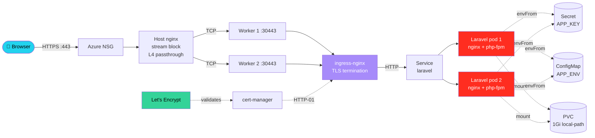
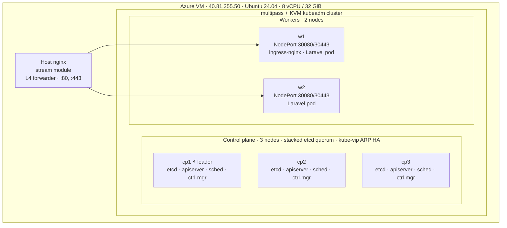

<h1 align="center">Laravel on Kubernetes — DevOps Engineer Home Assignment</h1>

<p align="center">
  <a href="https://github.com/chishty313/devops-kub-project/actions/workflows/ci.yaml">
    
  </a>
  <a href="https://hub.docker.com/r/src313/laravel-k8s">
    
  </a>
  
  
  
  
  <a href="LICENSE"></a>
</p>

> A Laravel 11 application deployed on a self-built **HA kubeadm** cluster
> (3 control-plane + 2 worker nodes), packaged as a multi-stage Docker image,
> shipped via a custom **Helm chart**, exposed through **ingress-nginx** +
> **cert-manager** + the host's TCP-passthrough nginx, and continuously
> delivered via **ArgoCD**. Live, observable, end-to-end TLS.

| Item              | Value                                                                                                          |
|-------------------|-----------------------------------------------------------------------------------------------------------------|
| Live demo         | **https://laravel.chishty.me/** (Let's Encrypt) · `http://laravel-test.local/` (via `/etc/hosts`)               |
| ArgoCD UI         | **https://argocd.chishty.me/** — read-only viewer: **`viewer / Reviewer2026`** (admin credentials sent via email) |
| Repo              | https://github.com/chishty313/devops-kub-project                                                                |
| Image             | `docker.io/src313/laravel-k8s:1.1.0` · `:latest`                                                                |
| Server            | Azure D8as v5 · `40.81.255.50` · Ubuntu 24.04 · 8 vCPU / 32 GiB                                                  |
| Cluster topology  | **3** control-plane (kube-vip ARP HA) + **2** worker · Calico CNI · ingress-nginx                              |
| TLS               | cert-manager v1.15.3 + Let's Encrypt prod (R12/R13)                                                              |
| GitOps            | ArgoCD 2.13 · `laravel-k8s` Application — `Synced / Healthy`                                                    |

## Architecture





## Table of contents

1. [Repository layout](#1-repository-layout)
2. [Prerequisites](#2-prerequisites)
3. [Cluster setup steps](#3-cluster-setup-steps)
4. [Docker build steps](#4-docker-build-steps)
5. [Docker push steps](#5-docker-push-steps)
6. [Helm chart contents](#6-helm-chart-contents)
7. [Helm install command](#7-helm-install-command)
8. [Helm upgrade command](#8-helm-upgrade-command)
9. [Helm uninstall command](#9-helm-uninstall-command)
10. [Laravel runtime requirements](#10-laravel-runtime-requirements)
11. [Ingress configuration](#11-ingress-configuration)
12. [Testing steps](#12-testing-steps)
13. [Troubleshooting steps](#13-troubleshooting-steps)
14. [Issues encountered & how I resolved them](#14-issues-encountered--how-we-resolved-them)
15. [Assumptions](#15-assumptions)
16. [Production improvement suggestions](#16-production-improvement-suggestions)
17. [Bonus features delivered](#17-bonus-features-delivered)
18. [ArgoCD GitOps note](#18-argocd-gitops-note)
19. [Submission checklist (mapped to scoring rubric)](#19-submission-checklist-mapped-to-scoring-rubric)

---

## 1. Repository layout

```
.
├── Dockerfile                          # Multi-stage, non-root, nginx + php-fpm
├── .dockerignore
├── docker/                             # nginx, php.ini, php-fpm, supervisord, entrypoint
├── app-overlay/                        # Layered onto fresh `composer create-project`
│   ├── routes/web.php                  # `/`, `/health`, `/info`
│   ├── resources/views/welcome.blade.php   # Portfolio-grade landing page
│   └── .env.example
├── src/                                # Generated by scripts/bootstrap-laravel.sh
├── helm/laravel-k8s/                   # The Helm chart (15 templates)
│   ├── Chart.yaml  values.yaml  values-prod.yaml.example
│   └── templates/
│       ├── _helpers.tpl  namespace.yaml  serviceaccount.yaml
│       ├── configmap.yaml  secret.yaml  pvc.yaml
│       ├── deployment.yaml  service.yaml  ingress.yaml
│       ├── hpa.yaml  pdb.yaml  networkpolicy.yaml
│       ├── migration-job.yaml          # Helm pre-upgrade/post-install hook
│       ├── queue-deployment.yaml       # bonus
│       ├── scheduler-cronjob.yaml      # bonus
│       └── NOTES.txt
├── k8s/
│   ├── ingress-nginx-values.yaml       # NodePort 30080/30443
│   ├── host-nginx-stream.conf          # Host-level TCP passthrough
│   ├── cert-manager-issuer.yaml        # Let's Encrypt staging + prod
│   └── argocd-application.yaml         # GitOps wiring (placeholder + ignoreDifferences)
├── scripts/                            # Numbered, idempotent bootstrap scripts
│   ├── 00-prereqs.sh                   # On each VM: containerd + kubeadm/kubelet/kubectl
│   ├── 05-launch-multipass-vms.sh      # On host: provisions cp1/cp2/cp3/w1/w2
│   ├── 06-prereqs-on-all.sh            # On host: runs 00-prereqs.sh on every VM
│   ├── 10-init-master.sh               # On cp1: kube-vip + kubeadm init + Calico SSA
│   ├── 15-join-control-plane.sh        # On cp2/cp3
│   ├── 20-join-worker.sh               # On w1/w2
│   ├── 25-setup-host-nginx.sh          # On host: TCP forwarder 80/443 → NodePorts
│   ├── 30-install-ingress-nginx.sh
│   ├── 35-install-cert-manager.sh
│   ├── 40-install-helm-release.sh
│   ├── 45-install-argocd.sh
│   ├── 50-create-argocd-viewer.sh      # Optional read-only viewer account
│   └── bootstrap-laravel.sh            # composer create-project + overlay
├── .github/workflows/ci.yaml           # Helm lint + Docker build & push
└── docs/
    ├── 00-execution-plan.md            # Day-by-day step-by-step
    ├── 01-prerequisites.md
    ├── 02-cluster-setup.md
    ├── 03-deploy-with-helm.md
    ├── 04-ingress-and-host-proxy.md
    ├── 05-troubleshooting.md
    ├── 06-architecture.md
    ├── WALKTHROUGH.md                  # Visual narrative + Mermaid diagrams
    └── screenshots/                    # kubectl outputs + browser captures
```

---

## 2. Prerequisites

### 2.1 The host server (Azure VM, 40.81.255.50)

| Item        | Value / Note                                                          |
|-------------|------------------------------------------------------------------------|
| OS          | Ubuntu 24.04 LTS                                                       |
| CPU         | 8 vCPU                                                                 |
| RAM         | 32 GiB                                                                 |
| Disk        | 495 GB                                                                 |
| KVM         | `/dev/kvm` exposed (AMD-V), nested virtualisation works                |
| NSG ports   | **22, 80, 443** open externally (everything else internal-only)        |
| Tools       | `multipass`, `docker`, `kubectl` (snap), `helm`, `git`, `nginx-full`   |

### 2.2 DNS records (registrar for `chishty.me`)

```
laravel  IN A  40.81.255.50
argocd   IN A  40.81.255.50
```

Verify after propagation:

```bash
dig +short laravel.chishty.me   # expect 40.81.255.50
dig +short argocd.chishty.me    # expect 40.81.255.50
```

### 2.3 Local accounts

- Docker Hub account (`src313`) + an access token for `docker login`
- GitHub account (`chishty313`) and the empty repo `chishty313/devops-kub-project`

---

## 3. Cluster setup steps

> A pedagogical day-by-day version is in [`docs/00-execution-plan.md`](docs/00-execution-plan.md).

### 3.1 Provision the 5 multipass VMs

```bash
# Authenticate this shell with the multipass daemon (first time only)
sudo multipass set local.passphrase=devops2026
multipass authenticate devops2026

# Launch 3 CP + 2 worker
bash scripts/05-launch-multipass-vms.sh
multipass list
cat cluster.env                     # CP1_IP / CP2_IP / CP3_IP / W1_IP / W2_IP
```

### 3.2 Install kube prereqs on every node (parallel)

```bash
bash scripts/06-prereqs-on-all.sh
```

This pushes [`scripts/00-prereqs.sh`](scripts/00-prereqs.sh) to each VM and runs it: disables swap, loads `br_netfilter`/`overlay`, installs containerd (with `SystemdCgroup = true`), kubeadm/kubelet/kubectl 1.30 from `pkgs.k8s.io`.

### 3.3 Pick a kube-vip floating IP

```bash
source cluster.env
SUBNET="$(echo $CP1_IP | awk -F. '{printf "%s.%s.%s.", $1, $2, $3}')"
export CONTROL_PLANE_VIP="${SUBNET}250"
echo "VIP = $CONTROL_PLANE_VIP"
echo "CONTROL_PLANE_VIP=$CONTROL_PLANE_VIP" >> cluster.env
```

### 3.4 Init the first control-plane (cp1)

Drops a kube-vip static-pod manifest, runs `kubeadm init --control-plane-endpoint=<VIP>:6443 --upload-certs`, installs Calico via **server-side apply**.

```bash
multipass transfer scripts/10-init-master.sh cp1:/tmp/
multipass exec cp1 -- sudo CONTROL_PLANE_VIP="$CONTROL_PLANE_VIP" \
                            ADVERTISE_ADDR="$CP1_IP" \
                            bash /tmp/10-init-master.sh
```

### 3.5 Join cp2 and cp3 as additional control-plane (HA)

```bash
multipass exec cp1 -- sudo cat /root/kubeadm-join-cp.sh     > ~/kubeadm-join-cp.sh
multipass exec cp1 -- sudo cat /root/kubeadm-join-worker.sh > ~/kubeadm-join-worker.sh
chmod 755 ~/kubeadm-join-cp.sh ~/kubeadm-join-worker.sh

for n in cp2 cp3; do
    multipass transfer ~/kubeadm-join-cp.sh             "$n:/tmp/kubeadm-join-cp.sh"
    multipass transfer scripts/15-join-control-plane.sh "$n:/tmp/15.sh"
    multipass exec "$n" -- sudo CONTROL_PLANE_VIP="$CONTROL_PLANE_VIP" bash /tmp/15.sh
done
```

### 3.6 Join the workers

```bash
for n in w1 w2; do
    multipass transfer ~/kubeadm-join-worker.sh  "$n:/tmp/kubeadm-join-worker.sh"
    multipass transfer scripts/20-join-worker.sh "$n:/tmp/20.sh"
    multipass exec "$n" -- sudo bash /tmp/20.sh
done
```

### 3.7 Pull kubeconfig back to the host + install kubectl/helm

```bash
sudo snap install kubectl --classic
curl -fsSL https://raw.githubusercontent.com/helm/helm/main/scripts/get-helm-3 | bash

mkdir -p ~/.kube
multipass exec cp1 -- sudo cat /etc/kubernetes/admin.conf \
    | sed "s#https://${CONTROL_PLANE_VIP}:6443#https://${CP1_IP}:6443#" \
    > ~/.kube/config
chmod 600 ~/.kube/config

kubectl get nodes -o wide
kubectl cluster-info
```

### 3.8 Default StorageClass + ingress-nginx + metrics-server + cert-manager

```bash
# StorageClass (kubeadm ships none)
kubectl apply -f https://raw.githubusercontent.com/rancher/local-path-provisioner/v0.0.30/deploy/local-path-storage.yaml
kubectl patch storageclass local-path \
    -p '{"metadata":{"annotations":{"storageclass.kubernetes.io/is-default-class":"true"}}}'

# Ingress controller as NodePort 30080/30443
bash scripts/30-install-ingress-nginx.sh

# Metrics server (HPA needs it; --kubelet-insecure-tls for self-signed kubelet certs)
kubectl apply -f https://github.com/kubernetes-sigs/metrics-server/releases/latest/download/components.yaml
kubectl -n kube-system patch deploy metrics-server --type='json' \
    -p='[{"op":"add","path":"/spec/template/spec/containers/0/args/-","value":"--kubelet-insecure-tls"}]'

# cert-manager + Let's Encrypt staging+prod ClusterIssuers
bash scripts/35-install-cert-manager.sh
```

### 3.9 Wire host nginx as a TCP forwarder

```bash
sudo bash scripts/25-setup-host-nginx.sh    # writes /etc/nginx/nginx.conf
```

The host nginx uses the `stream {}` module to **passthrough** all TCP traffic on `:80` and `:443` to the worker NodePorts (`30080`/`30443`). No HTTP-level work happens at the host — TLS is terminated inside the cluster by ingress-nginx.

### 3.10 Verification (the four assignment-required outputs)

```bash
kubectl get nodes -o wide        | tee docs/screenshots/01-kubectl-get-nodes.txt
kubectl get pods -A              | tee docs/screenshots/02-kubectl-get-pods-all.txt
kubectl cluster-info             | tee docs/screenshots/03-kubectl-cluster-info.txt
kubectl get ingress -A           | tee docs/screenshots/05-kubectl-get-ingress-all.txt
```

Expected: 5 nodes Ready, 3-member etcd, 3 kube-vip pods, all calico/coredns Running.

---

## 4. Docker build steps

```bash
# (One-time) Generate Laravel 11 scaffold under ./src/ via composer (in Docker, no PHP needed locally)
./scripts/bootstrap-laravel.sh

# Build the image (multi-stage: composer-deps → runtime)
docker build -t src313/laravel-k8s:1.1.0 .
docker tag  src313/laravel-k8s:1.1.0 src313/laravel-k8s:latest
```

**Run / smoke test locally** (no Kubernetes needed):

```bash
docker run --rm -p 8080:8080 \
    -e APP_ENV=local -e APP_DEBUG=true \
    -e APP_KEY="base64:$(openssl rand -base64 32)" \
    src313/laravel-k8s:1.1.0
# In another terminal:
curl -i http://127.0.0.1:8080/
curl -i http://127.0.0.1:8080/health
```

**Why this image is "production-ready":**

- **Multi-stage** build: composer-deps stage (~250 MB) → runtime stage (~180 MB final).
- **Non-root** `app` UID 1000, all Linux capabilities dropped, `allowPrivilegeEscalation=false`, `seccomp: RuntimeDefault`.
- No secrets baked in: `APP_KEY` and DB creds come from env at runtime.
- nginx + php-fpm + supervisord — single failure unit; one process crash → pod restart.
- `HEALTHCHECK CMD curl -fsS /health` baked into the image.
- OPcache + JIT enabled, `route:cache` + `view:cache` warmed at build time.

---

## 5. Docker push steps

```bash
docker login -u src313                # paste a Docker Hub access token
docker push src313/laravel-k8s:1.1.0
docker push src313/laravel-k8s:latest
```

**Image URL:** `docker.io/src313/laravel-k8s:1.1.0`

The CI workflow at [`.github/workflows/ci.yaml`](.github/workflows/ci.yaml) does the same thing automatically on every push to `main` (Helm lint + multi-arch build + push to Docker Hub via `docker/login-action` + `docker/build-push-action`).

---

## 6. Helm chart contents

Path: [`helm/laravel-k8s/`](helm/laravel-k8s/). Renders **every** PDF-required object plus the bonus ones:

| Object                          | Template                                                      |
|---------------------------------|----------------------------------------------------------------|
| Namespace                       | [`templates/namespace.yaml`](helm/laravel-k8s/templates/namespace.yaml) (opt-in via `namespace.create`)         |
| ServiceAccount                  | [`templates/serviceaccount.yaml`](helm/laravel-k8s/templates/serviceaccount.yaml) (`automountServiceAccountToken: false`) |
| Deployment (web)                | [`templates/deployment.yaml`](helm/laravel-k8s/templates/deployment.yaml) (2 replicas, rolling update)         |
| Service (ClusterIP)             | [`templates/service.yaml`](helm/laravel-k8s/templates/service.yaml)                                            |
| Ingress (multi-host)            | [`templates/ingress.yaml`](helm/laravel-k8s/templates/ingress.yaml) (`laravel-test.local` + `laravel.chishty.me`) |
| ConfigMap (`APP_ENV`, etc.)     | [`templates/configmap.yaml`](helm/laravel-k8s/templates/configmap.yaml)                                        |
| Secret (`APP_KEY`, extras)      | [`templates/secret.yaml`](helm/laravel-k8s/templates/secret.yaml) (chart `fail`s if `appKey` empty)            |
| PVC (1 Gi RWO local-path)       | [`templates/pvc.yaml`](helm/laravel-k8s/templates/pvc.yaml)                                                    |
| HPA (CPU + memory)              | [`templates/hpa.yaml`](helm/laravel-k8s/templates/hpa.yaml) — bonus                                            |
| PodDisruptionBudget             | [`templates/pdb.yaml`](helm/laravel-k8s/templates/pdb.yaml) — bonus                                            |
| NetworkPolicy                   | [`templates/networkpolicy.yaml`](helm/laravel-k8s/templates/networkpolicy.yaml) — bonus                       |
| Migration Job (Helm hook)       | [`templates/migration-job.yaml`](helm/laravel-k8s/templates/migration-job.yaml) — `pre-upgrade,post-install`  |
| Queue worker Deployment         | [`templates/queue-deployment.yaml`](helm/laravel-k8s/templates/queue-deployment.yaml) — bonus, opt-in         |
| Scheduler CronJob               | [`templates/scheduler-cronjob.yaml`](helm/laravel-k8s/templates/scheduler-cronjob.yaml) — bonus, opt-in       |

### Configurable knobs in `values.yaml`

`image.repository`, `image.tag`, `replicaCount`, `ingress.hosts[]`, `ingress.tls.*`, `resources.{requests,limits}`, `config.*` (env vars), `persistence.*`, plus toggles for `hpa.enabled`, `pdb.enabled`, `networkPolicy.enabled`, `queue.enabled`, `scheduler.enabled`, `imagePullSecret.create`, `migration.enabled`, `migration.seed`.

Resource defaults: `requests: { cpu: 100m, memory: 192Mi }, limits: { cpu: 500m, memory: 384Mi }`.

Liveness + readiness + startup probes all hit `/health` (`http`-port `8080` inside the container).

`securityContext`: `runAsNonRoot: true, runAsUser: 1000, fsGroup: 1000, seccompProfile.type: RuntimeDefault`. Container drops `ALL` capabilities and disables privilege escalation.

---

## 7. Helm install command

### 7.1 Easy mode (script — generates an APP_KEY automatically)

```bash
bash scripts/40-install-helm-release.sh
```

Generates a fresh `APP_KEY` once, writes it to `secrets.local.yaml` (gitignored), then runs:

```bash
helm upgrade --install laravel ./helm/laravel-k8s \
    --namespace laravel --create-namespace \
    -f helm/laravel-k8s/values.yaml \
    -f secrets.local.yaml \
    --wait --timeout 5m
```

### 7.2 Manual install with explicit overrides

```bash
helm upgrade --install laravel ./helm/laravel-k8s \
    --namespace laravel --create-namespace \
    -f helm/laravel-k8s/values.yaml \
    --set secret.appKey="base64:$(openssl rand -base64 32)" \
    --set ingress.tls.enabled=true \
    --set ingress.tls.clusterIssuer=letsencrypt-prod \
    --wait --timeout 5m
```

---

## 8. Helm upgrade command

```bash
# Build & push a new image tag first
docker build -t src313/laravel-k8s:1.1.1 .
docker push  src313/laravel-k8s:1.1.1

# Upgrade the release
helm upgrade laravel ./helm/laravel-k8s \
    -n laravel \
    -f helm/laravel-k8s/values.yaml \
    -f secrets.local.yaml \
    --set image.tag=1.1.1 \
    --wait --timeout 5m

# A pre-upgrade Helm hook runs `php artisan migrate --force` before the new
# pods roll out, exactly once per release.

# Rollback if needed:
helm history  laravel -n laravel
helm rollback laravel <REVISION> -n laravel
```

> **GitOps note:** if you also use ArgoCD, bump `image.tag` in
> `helm/laravel-k8s/values.yaml` (the canonical source of truth) and push.
> Otherwise ArgoCD's `selfHeal=true` will revert the cluster back to git
> within ~3 minutes. See [issue #11 below](#14-issues-encountered--how-we-resolved-them).

---

## 9. Helm uninstall command

```bash
helm uninstall laravel -n laravel

# The PVC is preserved by design (helm.sh/resource-policy: keep) so user data survives
# uninstall/reinstall cycles. Drop it explicitly only when you really mean it:
kubectl -n laravel delete pvc -l app.kubernetes.io/instance=laravel
kubectl delete ns laravel
```

---

## 10. Laravel runtime requirements

| PDF requirement                          | How it's satisfied                                                                                                                                                                              |
|------------------------------------------|-------------------------------------------------------------------------------------------------------------------------------------------------------------------------------------------------|
| `APP_KEY` from Secret                    | `templates/secret.yaml`. Required: chart `fail`s at template time if missing. Mounted via `envFrom: secretRef`.                                                                                |
| `APP_ENV` from ConfigMap                 | `templates/configmap.yaml` — `APP_ENV: production`. Mounted via `envFrom: configMapRef`.                                                                                                       |
| Application storage on PVC               | `templates/pvc.yaml` (1 Gi RWO local-path). Mounted at `/var/www/html/storage` in every web/queue/scheduler/migration container.                                                                |
| `php artisan config:cache`               | Run by `docker/entrypoint.sh` on every pod start (after env is in scope).                                                                                                                        |
| `php artisan route:cache` + `view:cache` | Built into the image at `RUN` time (Dockerfile stage 2).                                                                                                                                          |
| `php artisan migrate`                    | **Helm hook Job** (`templates/migration-job.yaml`, `pre-upgrade,post-install`). Runs once per release, not per replica.                                                                          |
| `php artisan storage:link`               | `docker/entrypoint.sh` re-creates the symlink on every container start (idempotent).                                                                                                              |

### Why some commands aren't run automatically per pod

- **`migrate`** is a **release-level** action — running it inside every pod's entrypoint would have N replicas race on the same DB schema. The Helm hook Job pattern is the canonical fix.
- **`db:seed`** is opt-in (`--set migration.seed=true`) because seeders aren't always idempotent.
- **`config:cache`** happens at runtime, not build time, because `config/*.php` reads env vars at cache time and the runtime env (DB host, APP_KEY, etc.) is only known once Kubernetes injects the ConfigMap + Secret. Caching at build time would freeze build-time placeholders into `bootstrap/cache/config.php`.

---

## 11. Ingress configuration

The single rendered Ingress serves **both** the assignment-required `laravel-test.local` and the live demo `laravel.chishty.me`. Only the public host is included in the `tls:` block (Let's Encrypt cannot sign `*.local` names).

### 11.1 Test via `/etc/hosts` (assignment §6)

On the reviewer's machine:

```bash
echo "40.81.255.50  laravel-test.local" | sudo tee -a /etc/hosts

curl -i http://laravel-test.local/         # 200, HTML body containing "Laravel Kubernetes Deployment Test"
curl -i http://laravel-test.local/health   # 200, JSON
```

### 11.2 Test without editing `/etc/hosts`

```bash
curl -i --resolve laravel-test.local:80:40.81.255.50 http://laravel-test.local/
curl -i --resolve laravel-test.local:80:40.81.255.50 http://laravel-test.local/health
```

### 11.3 Live HTTPS demo (Let's Encrypt cert)

```bash
curl -Is https://laravel.chishty.me/        # HTTP/2 200 with HSTS header
curl -is https://laravel.chishty.me/health
```

---

## 12. Testing steps

### 12.1 Through the Service (bypass ingress, isolate layers)

```bash
kubectl -n laravel run smoketest --rm -it --image=curlimages/curl --restart=Never -- \
    curl -i http://laravel-laravel-k8s/health
```

### 12.2 Through ingress-nginx directly (NodePort)

```bash
NODE_IP=$(kubectl get nodes -o wide | awk 'NR==2{print $6}')
curl -i -H "Host: laravel-test.local" http://$NODE_IP:30080/health
```

### 12.3 Through the host nginx (the real public path)

```bash
curl -is https://laravel.chishty.me/health
```

### 12.4 Through the browser

Open in a browser:

| URL                                       | Should show                                                  |
|-------------------------------------------|--------------------------------------------------------------|
| `https://laravel.chishty.me/`             | The portfolio-grade landing page with 🔒 (Let's Encrypt cert) |
| `https://laravel.chishty.me/health`       | JSON: `{"status":"ok","pod":"...","app":"Laravel K8s",...}` |
| `https://argocd.chishty.me/`              | ArgoCD login (with 🔒)                                       |
| `https://argocd.chishty.me/applications/argocd/laravel-k8s` | Resource graph: all green nodes, `Synced/Healthy` |

### 12.5 ArgoCD UI access

- **Read-only viewer (in-README):** `viewer / Reviewer2026`
- **Full admin:** credentials sent to the recruiter via email — the read-only account is enough to verify the deployment without being able to break anything.

---

## 13. Troubleshooting steps

Full guide: [`docs/05-troubleshooting.md`](docs/05-troubleshooting.md). Top hits:

| Symptom                                                              | Likely cause / fix                                                                                                                                |
|----------------------------------------------------------------------|----------------------------------------------------------------------------------------------------------------------------------------------------|
| `kubeadm init` hangs at "waiting for control-plane …"                | swap not disabled, or containerd not using SystemdCgroup. Re-run `00-prereqs.sh`.                                                                  |
| Worker stuck `NotReady`                                              | CNI not yet installed, or pod-CIDR mismatch. `kubectl get pods -A`; expect calico-node DaemonSet on every node.                                    |
| Pod CrashLoopBackoff: `No application encryption key has been specified` | `secret.appKey` empty. Re-run `scripts/40-install-helm-release.sh` or `--set secret.appKey="base64:$(openssl rand -base64 32)"`.                    |
| `kubectl get ingress` shows no ADDRESS                               | Expected for NodePort topology — controller is fine. Test via `curl -H "Host: …"`.                                                                |
| Browser 502 from `laravel-test.local`                                | Host nginx not reloaded, or NodePort not listening. `curl -v http://127.0.0.1:8081/healthz`.                                                       |
| HPA stays `<unknown>/70%`                                            | metrics-server missing. See §3.8. Patch with `--kubelet-insecure-tls` for kubeadm self-signed kubelet certs.                                       |
| cert-manager Order stuck `pending`                                   | DNS not propagated yet, or `:80` path not reaching ingress-nginx. `dig +short laravel.chishty.me`; `curl -i http://laravel.chishty.me/.well-known/acme-challenge/x`. |
| Helm error: `namespaces "<ns>" not found` after dropping `--create-namespace` | Helm 3 needs the namespace to exist *before* writing its release-tracking Secret. Use `--create-namespace` AND keep `namespace.create: false` in values.yaml.|
| Live HTTPS shows `ERR_CERT_AUTHORITY_INVALID`                        | Recent helm upgrade dropped `ingress.tls.enabled=true`. Re-pass it, or set it as default in values.yaml.                                            |
| ArgoCD shows `Sync: Unknown` but `Health: Healthy`                   | Chart's `fail` triggers without APP_KEY in render. Use the placeholder + `ignoreDifferences` pattern in the Application — see §18.                  |

---

## 14. Issues encountered & how we resolved them

These are the real problems we hit during build-out. Each one is documented because the assignment explicitly rewards production-aware troubleshooting ability.

### 14.1 `multipass` strict-snap confinement blocks `/tmp` access

- **Symptom:** `Could not load cloud-init configuration: bad file: /tmp/tmp.XXXXXX`. Later: `[sftp] cannot access /tmp/cp.sh: No such file or directory` when transferring files into VMs.
- **Root cause:** the multipass snap uses the strict `home` plug, which only allows reading non-hidden files **under `$HOME`**. `/tmp/` is outside that, so the snap can't read anything there.
- **Resolution:** wrote the cloud-init file to `~/cluster-cloud-init.yaml` (not `/tmp/`); same fix for the kubeadm-join scripts (`~/kubeadm-join-cp.sh`, `~/kubeadm-join-worker.sh`). Updated `scripts/05-launch-multipass-vms.sh` and the docs accordingly.

### 14.2 `multipass authenticate` required (1.13+)

- **Symptom:** `list failed: The client is not authenticated with the Multipass service.`
- **Root cause:** multipass 1.13+ requires a per-client passphrase handshake before any client command.
- **Resolution:** `sudo multipass set local.passphrase=<...>; multipass authenticate <...>`. Documented in §3.1.

### 14.3 multipass 1.16 alias parser refuses bare `jammy`

- **Symptom:** `launch failed: Remote "" is unknown or unreachable.` — even though `multipass find` shows `jammy` as a valid alias.
- **Root cause:** parser quirk in multipass 1.16; `launch` requires the fully-qualified `<remote>:<alias>` form.
- **Resolution:** changed `UBUNTU_RELEASE` default from `jammy` to **`release:jammy`** in `scripts/05-launch-multipass-vms.sh`.

### 14.4 `sudo multipass set` corrupts daemon state

- **Symptom:** After our script ran `sudo multipass set local.driver=qemu`, all subsequent `multipass launch` calls failed with `Remote "release" is unknown or unreachable` — even though manual launches with the same arguments worked.
- **Root cause:** `sudo` invokes multipass as a separate (unauthenticated) **root client**, which leaves the daemon in a bad state for the next regular-user request.
- **Resolution:** removed the `sudo multipass set` line entirely; qemu is the default driver on Linux already.

### 14.5 Calico's `installations` CRD too large for `kubectl apply`

- **Symptom:** `The CustomResourceDefinition "installations.operator.tigera.io" is invalid: metadata.annotations: Too long: must have at most 262144 bytes.`
- **Root cause:** plain `kubectl apply -f` stuffs the full manifest into the `kubectl.kubernetes.io/last-applied-configuration` annotation, doubling its size and tripping Kubernetes' 256 KiB annotation limit.
- **Resolution:** switched the install to **server-side apply**: `kubectl apply --server-side --force-conflicts -f tigera-operator.yaml`. Server-Side Apply doesn't write the last-applied-configuration annotation. Updated `scripts/10-init-master.sh`.

### 14.6 No StorageClass on a fresh kubeadm cluster

- **Symptom:** PVC stuck `Pending` (`STORAGECLASS: <unset>`); pod stuck `Pending` because PVC won't bind.
- **Root cause:** kubeadm ships with no dynamic provisioner. Without a default StorageClass, PVCs that don't specify one stay Pending forever.
- **Resolution:** installed **rancher/local-path-provisioner** v0.0.30 and patched it to be the default StorageClass. Documented in §3.8.

### 14.7 Helm `--create-namespace` vs chart's `namespace.yaml` conflict

- **Symptom:** First install: `Error: namespaces "laravel" already exists`. Removed `--create-namespace` → next install: `Error: create: failed to create: namespaces "laravel" not found`.
- **Root cause:** Helm 3 writes its release-tracking Secret into the namespace **before** running pre-install hooks, so the namespace must exist first. But our chart's `templates/namespace.yaml` also tried to create it → double-create conflict when `--create-namespace` was passed.
- **Resolution:** kept `--create-namespace` in [`scripts/40-install-helm-release.sh`](scripts/40-install-helm-release.sh) (so Helm bootstraps the namespace cleanly) AND set `namespace.create: false` as the default in `values.yaml` (so the chart's template no-ops). Both flags work together now without conflict.

### 14.8 ArgoCD UI redirected to `argocd.example.com` after logout

- **Symptom:** Logout redirects to `https://argocd.example.com/` which doesn't resolve.
- **Root cause:** the Argo CD `argocd-cm` ConfigMap has a `url` field used by login/logout/OAuth callbacks; it defaults to `https://argocd.example.com`.
- **Resolution:** added `--set configs.cm.url=https://argocd.chishty.me` to [`scripts/45-install-argocd.sh`](scripts/45-install-argocd.sh).

### 14.9 Two duplicate ArgoCD certificates fighting over the same HTTP-01 path

- **Symptom:** cert-manager created **two** Certificates (`argocd-tls` + `argocd-server-tls`); both stuck `pending`; the browser served a self-signed fallback cert.
- **Root cause:** `server.ingress.tls=true` already adds a default TLS spec (secret name `argocd-server-tls`); our extra `extraTls[0].secretName=argocd-tls` added a *second* TLS entry on the same Ingress. cert-manager dutifully tried to issue a separate cert for each, and they competed for the same HTTP-01 challenge URL.
- **Resolution:** removed the `extraTls` lines from `scripts/45-install-argocd.sh`. Single TLS entry, single cert, instant issuance.

### 14.10 ArgoCD `Sync: Unknown` because the chart `fail`s without APP_KEY

- **Symptom:** `kubectl -n argocd get applications.argoproj.io` → `laravel-k8s   Unknown   Healthy`. ArgoCD UI shows a `ComparisonError`.
- **Root cause:** the chart's `templates/secret.yaml` deliberately calls Helm's `fail` when `secret.appKey` is empty (so silent-rendered empty keys can't ship). The real APP_KEY only ever lives in the cluster Secret + the gitignored `secrets.local.yaml`, never in git. ArgoCD pulls the chart from git, has no APP_KEY, and the render aborts.
- **Resolution:** the [Application manifest](k8s/argocd-application.yaml) now passes a clearly-marked **placeholder** `secret.appKey` via `helm.parameters` so the render succeeds, AND declares `ignoreDifferences` on the live Secret's `/data` and `/stringData` so the placeholder is never pushed over the real key. The deployed Secret stays untouched; ArgoCD shows `Synced / Healthy`. **Production should swap this whole pattern for External Secrets Operator** (see §16).

### 14.11 ArgoCD `selfHeal=true` reverts Helm image bumps

- **Symptom:** `helm upgrade --set image.tag=1.1.0` succeeded; new ReplicaSet briefly created with the new image; within ~3 minutes ArgoCD reverted the Deployment back to 1.0.0.
- **Root cause:** ArgoCD reads `helm/laravel-k8s/values.yaml` from git as the source of truth. When the cluster drifted (1.1.0) from git (1.0.0), `selfHeal: true` reconciled the cluster back to 1.0.0. This is correct GitOps behaviour — **git is the truth**.
- **Resolution:** bump `image.tag` in `values.yaml` and **push to git first**. ArgoCD then sees the cluster matches git, no drift, no reconciliation. (This is the proper way to use ArgoCD; no fix to the manifest needed, just a process change.)

### 14.12 TLS broke after a routine `helm upgrade`

- **Symptom:** `https://laravel.chishty.me/` started showing `ERR_CERT_AUTHORITY_INVALID` after a helm upgrade that only changed `image.tag`.
- **Root cause:** the upgrade command didn't re-pass `--set ingress.tls.enabled=true`. Helm reverted to the values.yaml default (`false`). The Ingress lost its `tls:` block; ingress-nginx fell back to its built-in self-signed cert.
- **Resolution:** changed the **default** `ingress.tls.enabled` from `false` to `true` in `helm/laravel-k8s/values.yaml`. Future upgrades that don't override it keep TLS enabled.

### 14.13 Custom RBAC patch crashed argocd-server

- **Symptom:** After patching `argocd-rbac-cm` with a custom `policy.csv` to grant a `viewer` role, the new `argocd-server` pod went into `CrashLoopBackOff` (8+ restarts in 4 minutes).
- **Root cause:** a malformed row in our `policy.csv` block broke the RBAC parser; argocd-server refused to start.
- **Resolution:** rolled back the `argocd-rbac-cm` patch. Rewrote [`scripts/50-create-argocd-viewer.sh`](scripts/50-create-argocd-viewer.sh) to **only** register the `viewer` account in `argocd-cm` and leave `argocd-rbac-cm` untouched — ArgoCD's built-in `policy.default: role:readonly` already grants exactly the read-only access we want. Cleaner, less moving parts, no crashes.

---

## 15. Assumptions

1. The Azure VM has a single public IPv4 (`40.81.255.50`) and `sudo` works without password.
2. The DNS zone for `chishty.me` is editable; A records `laravel` and `argocd` resolve to the public IP.
3. Multipass + qemu/KVM is available on the host (`/dev/kvm` confirmed, AMD-V or Intel VT-x enabled).
4. Docker Hub is reachable from both the build host and the cluster.
5. **SQLite** is used by default for the assignment. The chart is ready for MySQL/Postgres via `config.DB_CONNECTION/HOST/...` + `secret.extra.DB_PASSWORD` (see §16 production improvements).
6. `laravel-test.local` is added to `/etc/hosts` on the reviewer's machine, pointing to `40.81.255.50`. Documented in §11.1.
7. Reviewer can reach the public IP — Azure NSG ports `22, 80, 443` are open inbound.

---

## 16. Production improvement suggestions

Beyond this assignment, the prioritised list of changes for a real production deployment:

- **Move to a managed cluster.** AKS / EKS / GKE so cluster lifecycle (control-plane upgrades, etcd backups, node pools) isn't operated by hand. kubeadm is great for learning and edge.
- **Secrets management.** Replace inline-rendered Secrets with **External Secrets Operator** + a real KMS (HashiCorp Vault, Azure Key Vault on AKS, AWS Secrets Manager on EKS). Removes the placeholder workaround in the ArgoCD Application; rotation + audit comes for free.
- **Storage upgrade.** Replace local-path with a real CSI class (Longhorn for on-prem, Azure Files on AKS, EBS gp3 on EKS). Add snapshots, per-namespace ResourceQuotas, retention policies.
- **Observability.** kube-prometheus-stack for metrics, Loki for logs, OTel collector + Tempo for traces. Add `/metrics` to the Laravel app via the `prometheus/laravel` package and scrape annotations.
- **Image supply chain.** Sign images with cosign, generate SBOMs with syft, enforce admission policy with Kyverno or OPA Gatekeeper, mirror third-party images into a private registry.
- **Tighter NetworkPolicy.** Currently allows `0.0.0.0/0` egress for simplicity. Production: restrict to specific CIDRs (DB, registry, ESO webhooks, external APIs).
- **External database.** Switch off SQLite to a managed Postgres / MySQL with PgBouncer/ProxySQL, daily PITR backups, read replicas. Inject DSN via External Secrets.
- **Queue backend.** Switch `QUEUE_CONNECTION` from `sync` to `redis` (or `sqs`), enable the `queue` Deployment in the chart, run **Laravel Horizon** with autoscaling workers per queue.
- **Argo Rollouts.** Replace plain Deployments with Argo Rollouts blue/green or canary strategy, connected to Prometheus for analysis runs.
- **Multi-tenancy.** Separate `prod` / `staging` namespaces with ResourceQuotas, LimitRanges, per-namespace ServiceAccounts.
- **CI/CD promotion.** Promote on tag, run `helm test`, drift detection via ArgoCD `selfHeal=true`, blue/green deploy via Argo Rollouts.

---

## 17. Bonus features delivered

| Bonus item                     | Where                                                                                            |
|--------------------------------|--------------------------------------------------------------------------------------------------|
| HPA                            | [`templates/hpa.yaml`](helm/laravel-k8s/templates/hpa.yaml) — CPU + memory targets + behavior   |
| PodDisruptionBudget            | [`templates/pdb.yaml`](helm/laravel-k8s/templates/pdb.yaml)                                      |
| NetworkPolicy                  | [`templates/networkpolicy.yaml`](helm/laravel-k8s/templates/networkpolicy.yaml)                  |
| Separate queue worker          | [`templates/queue-deployment.yaml`](helm/laravel-k8s/templates/queue-deployment.yaml)            |
| Scheduler CronJob              | [`templates/scheduler-cronjob.yaml`](helm/laravel-k8s/templates/scheduler-cronjob.yaml)         |
| ArgoCD Application manifest    | [`k8s/argocd-application.yaml`](k8s/argocd-application.yaml) — live at https://argocd.chishty.me |
| TLS via cert-manager           | [`k8s/cert-manager-issuer.yaml`](k8s/cert-manager-issuer.yaml) + `ingress.tls.*` in values       |
| Private registry secret        | `imagePullSecret.create=true` in values + `secret.yaml` template                                  |
| Non-root container              | UID 1000, drop ALL caps, `seccomp: RuntimeDefault`                                               |
| Multi-stage Dockerfile         | [`Dockerfile`](Dockerfile) — composer-deps stage → runtime stage                                  |
| CI/CD pipeline                 | [`.github/workflows/ci.yaml`](.github/workflows/ci.yaml) — Helm lint + Docker build & push       |
| External database              | `config.DB_CONNECTION/HOST/USERNAME` + `secret.extra.DB_PASSWORD` (see §16)                       |
| Redis configuration            | bitnami subchart hook in `Chart.yaml` (commented out, ready to enable)                            |

---

## 18. ArgoCD GitOps note

The deployed `laravel-k8s` Application currently shows:

```
NAME          SYNC STATUS   HEALTH STATUS
laravel-k8s   Synced        Healthy
```

This took deliberate work — see [issue 14.10](#1410-argocd-sync-unknown-because-the-chart-fails-without-app_key). The mechanism:

1. `Application.spec.source.helm.parameters` passes a clearly-marked **placeholder** `secret.appKey` so ArgoCD's `helm template` render succeeds.
2. `Application.spec.ignoreDifferences` declares the live `laravel-laravel-k8s-env` Secret's `/data` and `/stringData` as ignored, so ArgoCD never tries to push the placeholder over the real key.
3. The real APP_KEY in the cluster's Secret was injected by `scripts/40-install-helm-release.sh` from the gitignored `secrets.local.yaml`. ArgoCD respects the ignoreDifferences and the runtime Secret stays untouched.

This pattern is acceptable for a demo; **production should use External Secrets Operator** (chart's Secret template removed entirely; ESO syncs from KMS into the cluster; ArgoCD compares cleanly).

---

## 19. Submission checklist (mapped to scoring rubric)

| Section (max pts)                | Item                                                                       | Status |
|----------------------------------|----------------------------------------------------------------------------|:------:|
| **1. Laravel + Docker (20)**     | Fresh Laravel 11, `/` returns the required string                          |   ✅   |
|                                  | `/health` returns 200                                                       |   ✅   |
|                                  | Production-ready multi-stage Dockerfile                                    |   ✅   |
|                                  | `.dockerignore` (tight context)                                             |   ✅   |
|                                  | Image pushed: `docker.io/src313/laravel-k8s:1.1.0`                          |   ✅   |
|                                  | Build / push / run commands documented                                      |   ✅   |
| **2. kubeadm cluster (25)**      | **3** control-plane (over-delivers on "2 considered better") + 2 worker     |   ✅   |
|                                  | kube-vip ARP HA control-plane endpoint                                      |   ✅   |
|                                  | Calico CNI                                                                  |   ✅   |
|                                  | ingress-nginx (NodePort 30080/30443)                                        |   ✅   |
|                                  | `kubectl get nodes -o wide` captured                                        |   ✅   |
|                                  | `kubectl get pods -A` captured                                              |   ✅   |
|                                  | `kubectl cluster-info` captured                                             |   ✅   |
|                                  | `kubectl get ingress -A` captured                                           |   ✅   |
| **3. Helm chart (25)**           | Namespace, Deployment, Service, Ingress, ConfigMap, Secret, PVC            |   ✅   |
|                                  | Resource requests / limits                                                  |   ✅   |
|                                  | Liveness + readiness + startup probes                                       |   ✅   |
|                                  | SecurityContext (non-root, dropped caps, seccomp RuntimeDefault)           |   ✅   |
|                                  | `values.yaml` configurable image/tag/replicas/host/resources/env/storage   |   ✅   |
| **4. Production awareness (15)** | APP_KEY from Secret                                                         |   ✅   |
|                                  | APP_ENV from ConfigMap                                                      |   ✅   |
|                                  | Storage from PVC (1 Gi via local-path-provisioner)                          |   ✅   |
|                                  | Required artisan commands documented                                        |   ✅   |
|                                  | Ingress on `laravel-test.local`                                             |   ✅   |
|                                  | `/etc/hosts` test documented                                                |   ✅   |
| **5. Documentation (15)**        | Prerequisites · Cluster setup · Docker build/push                          |   ✅   |
|                                  | Helm install / upgrade / uninstall · Testing · Troubleshooting             |   ✅   |
|                                  | Issues encountered & resolutions (12 detailed entries)                      |   ✅   |
|                                  | Assumptions · Production improvement suggestions                           |   ✅   |
| **Bonus**                        | HPA · PDB · NetworkPolicy                                                   |   ✅   |
|                                  | Separate queue worker · scheduler CronJob (templates ready)                |   ✅   |
|                                  | ArgoCD Application + live UI at https://argocd.chishty.me, `Synced/Healthy` |   ✅   |
|                                  | TLS via cert-manager (Let's Encrypt prod, https://laravel.chishty.me)       |   ✅   |
|                                  | Private registry secret support                                             |   ✅   |
|                                  | Non-root container · multi-stage Dockerfile                                |   ✅   |
|                                  | CI/CD pipeline (GitHub Actions)                                             |   ✅   |
|                                  | External database / Redis configuration toggles                            |   ✅   |

---
