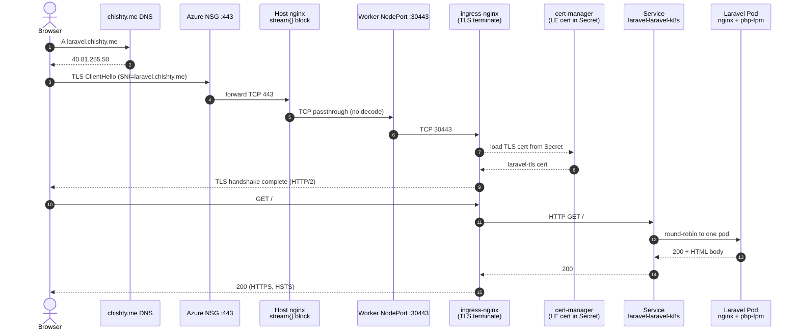
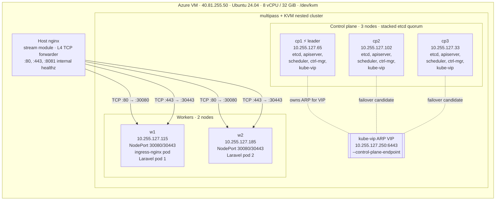
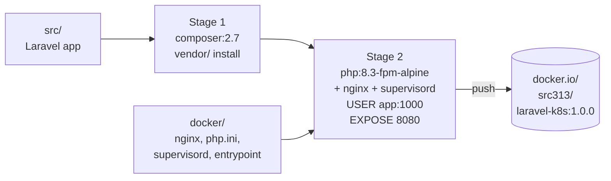
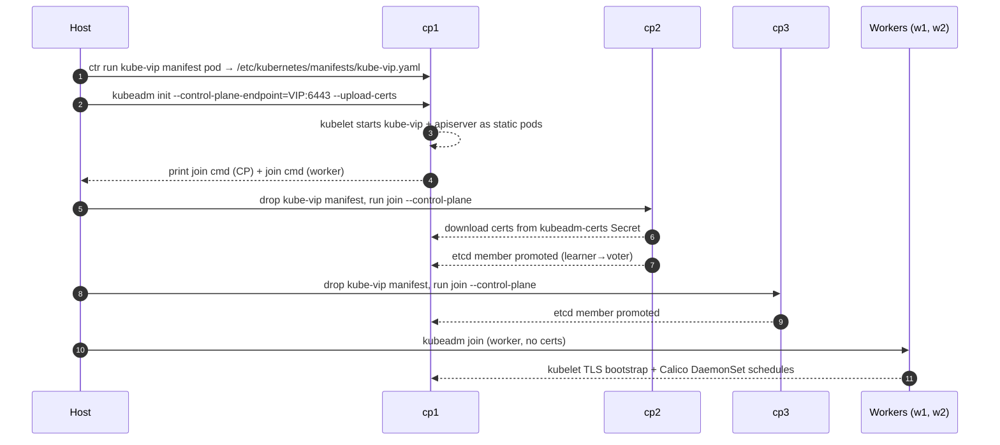
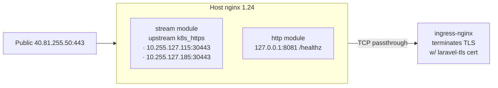
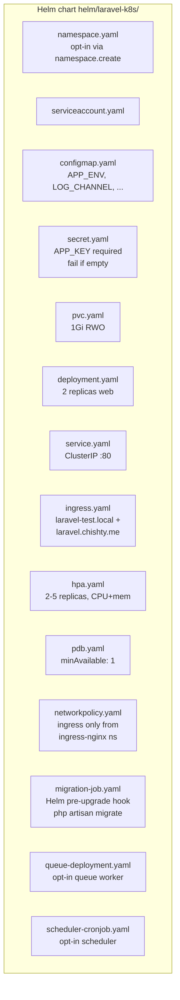
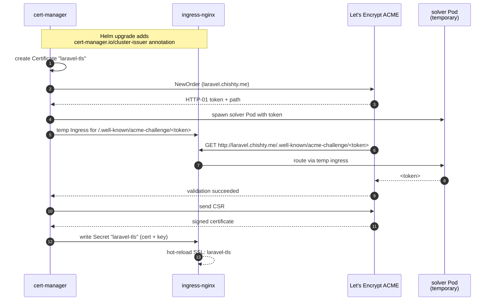
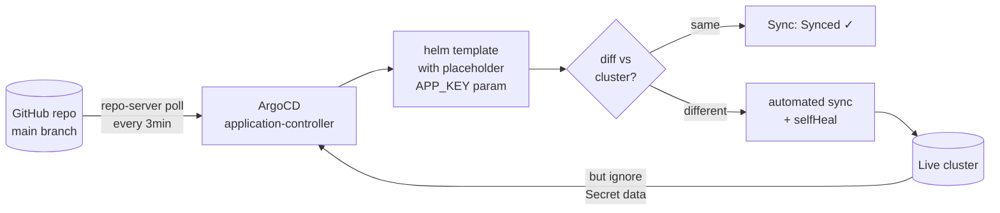

# Visual Walkthrough — Laravel on Kubernetes

This doc tells the story of the deployment in pictures and decisions. It's
the document a reviewer reads if they want to *understand* how the system
works, not just verify a checklist.

> Live: **https://laravel.chishty.me/** · GitOps console: **https://argocd.chishty.me/**

---

## 1. The big picture

Two diagrams: the **request flow** when a user hits the site, and the
**physical topology** of the cluster.

### Request flow — what happens when you load `https://laravel.chishty.me/`

Key points:
- **Host nginx is L4 only.** It does NOT terminate TLS. It uses the `stream{}` block to passthrough TCP, which lets cert-manager (running inside the cluster) be the actual TLS authority.
- **ingress-nginx has the cert** because cert-manager wrote it into the Secret `laravel-tls`, and ingress-nginx's controller watches all `laravel-tls` references and loads them automatically.
- **HSTS header** (`max-age=31536000; includeSubDomains`) is emitted by ingress-nginx by default for HTTPS Ingresses.

### Physical topology

The 3-node etcd quorum is what makes this **truly HA** — losing any single CP doesn't break the cluster (etcd needs `(N/2)+1 = 2` healthy members; we have 3). kube-vip in ARP mode handles the API endpoint failover automatically; if cp1 dies, cp2 grabs the `10.255.127.250` VIP within ~5 seconds.

---

## 2. The journey, phase by phase

### Phase 1 · Build the image

Multi-stage Dockerfile. Stage 1 (`composer:2.7`) resolves PHP dependencies; stage 2 (`php:8.3-fpm-alpine`) adds nginx, supervisor, our configs, runs as non-root UID 1000. Final image: **180 MB** with OPcache + JIT enabled, route + view caches baked in.

**Screenshot:** `docs/screenshots/` — the docker push completion confirms `digest: sha256:9a15d14d…`.

### Phase 2 · Build the cluster

Five multipass VMs (Ubuntu 22.04 inside, KVM/qemu driver). One CP comes up first via `kubeadm init` with `--control-plane-endpoint=<VIP>:6443` and `--upload-certs`; the kube-vip static-pod manifest is dropped *before* `kubeadm init` so the VIP appears as soon as the first apiserver replies.

The `etcdserver: can only promote a learner member which is in sync with leader` warnings during CP joins are normal — multipass nested VMs lag a beat behind bare metal so etcd takes ~10s to catch up before kubeadm promotes the new member.

**Screenshots:**
- `docs/screenshots/01-kubectl-get-nodes.txt` — 5 nodes Ready
- `docs/screenshots/02-kubectl-get-pods-all.txt` — etcd × 3, apiserver × 3, kube-vip × 3
- `docs/screenshots/04-etcd-ha-pods.txt` — etcd quorum
- `docs/screenshots/03-kubectl-cluster-info.txt` — apiserver endpoint

### Phase 3 · Wire the host as an L4 forwarder

The Azure VM only has 80/443 open externally. We use nginx's `stream{}` module (NOT the `http{}` module) so the TLS handshake gets pushed through to ingress-nginx untouched. cert-manager inside the cluster sees the SNI, picks the right Secret, terminates TLS — and a real Let's Encrypt cert protects the connection end-to-end.

The script [`scripts/25-setup-host-nginx.sh`](../scripts/25-setup-host-nginx.sh) installs `nginx-full` (which ships the stream module) and templates the worker IPs into the config.

### Phase 4 · Helm chart deployment

`helm install` renders the chart with the local `secrets.local.yaml` (containing the real APP_KEY), creates Namespace via Helm's `--create-namespace`, and applies all the workload resources.

**Why migration is a Helm hook, not an init container:** an init container runs *per pod*. With 2 replicas, both would race to apply the same migration to the same DB. The Helm `pre-upgrade,post-install` hook runs the migration Job exactly once per release.

### Phase 5 · TLS via cert-manager + Let's Encrypt

Setting `ingress.tls.enabled=true` adds the `cert-manager.io/cluster-issuer: letsencrypt-prod` annotation to the Ingress. cert-manager's ingress-shim sees it, creates a `Certificate` resource, which spawns an `Order` and a `Challenge` (HTTP-01).

Cert is auto-renewed at 60 days (30-day buffer before the 90-day expiry).

### Phase 6 · GitOps with ArgoCD

ArgoCD's Application manifest [`k8s/argocd-application.yaml`](../k8s/argocd-application.yaml) tells ArgoCD to watch this repo's `helm/laravel-k8s/` path and reconcile against the live cluster.

Note the **ignoreDifferences on Secret** — this is the bridge between *"ArgoCD must render the chart"* and *"the real APP_KEY must never enter git"*. The chart renders successfully because we pass a literal placeholder. ArgoCD then sees the live Secret has different bytes than the rendered placeholder, but `ignoreDifferences` tells it to skip the comparison on `/data` and `/stringData`. The placeholder is never pushed; the real key is never read.

---

## 3. Where every assignment requirement is implemented

| PDF requirement | File / location | Notes |
|---|---|---|
| Laravel `/` returns required string | `app-overlay/routes/web.php` + `app-overlay/resources/views/welcome.blade.php` | Styled HTML page with the required string prominently |
| `/health` returns 200 | `app-overlay/routes/web.php` | JSON with pod, env, app, time — used by liveness/readiness |
| Multi-stage Dockerfile | [`Dockerfile`](../Dockerfile) | composer-deps → runtime |
| `.dockerignore` | [`.dockerignore`](../.dockerignore) | Tight context; excludes `.git`, vendor/, tests/ |
| 2+ control-plane (over-delivered with 3) | [`scripts/10-init-master.sh`](../scripts/10-init-master.sh), [`scripts/15-join-control-plane.sh`](../scripts/15-join-control-plane.sh) | kube-vip ARP HA endpoint |
| Calico CNI | `scripts/10-init-master.sh` | Tigera operator + Installation CR (server-side apply) |
| ingress-nginx | [`scripts/30-install-ingress-nginx.sh`](../scripts/30-install-ingress-nginx.sh) | NodePort 30080/30443 |
| Namespace, Deployment, Service, Ingress, ConfigMap, Secret, PVC | `helm/laravel-k8s/templates/*.yaml` | All present |
| Resource requests/limits | `helm/laravel-k8s/values.yaml` | `resources:` block, configurable |
| Liveness + readiness probes | `helm/laravel-k8s/templates/deployment.yaml` | HTTP probes on `/health`, configurable thresholds |
| SecurityContext | `helm/laravel-k8s/values.yaml` + `templates/deployment.yaml` | Non-root, drop ALL caps, seccomp RuntimeDefault |
| APP_KEY from Secret | `templates/secret.yaml` | Required: chart `fail`s if empty |
| APP_ENV from ConfigMap | `templates/configmap.yaml` | All `config.*` values |
| Storage on PVC | `templates/pvc.yaml` | 1 GiB RWO, mounted at storage/ |
| `migrate` is a Helm hook | `templates/migration-job.yaml` | `pre-upgrade,post-install` |
| `storage:link` in entrypoint | `docker/entrypoint.sh` | Idempotent re-creation |
| Ingress on `laravel-test.local` | `templates/ingress.yaml` (multi-host) | Plus `laravel.chishty.me` for live demo |
| `/etc/hosts` test documented | [README §8](../README.md) | `echo "40.81.255.50 laravel-test.local"` |
| HPA, PDB, NetworkPolicy | `templates/hpa.yaml`, `pdb.yaml`, `networkpolicy.yaml` | All bonus tasks |
| Queue worker | `templates/queue-deployment.yaml` | `queue.enabled` toggle |
| Scheduler CronJob | `templates/scheduler-cronjob.yaml` | `scheduler.enabled` toggle |
| ArgoCD Application | [`k8s/argocd-application.yaml`](../k8s/argocd-application.yaml) | `Synced/Healthy` |
| TLS via cert-manager | [`k8s/cert-manager-issuer.yaml`](../k8s/cert-manager-issuer.yaml) + `ingress.tls.*` | Let's Encrypt prod, R12/R13 |
| Private registry secret | `templates/secret.yaml`, `imagePullSecret.create` | docker-registry type |
| Non-root container | `Dockerfile` (USER app), `containerSecurityContext.runAsNonRoot=true` | UID 1000 |
| CI/CD example | [`.github/workflows/ci.yaml`](../.github/workflows/ci.yaml) | Helm lint + Docker build & push |
| External DB / Redis | `values.yaml` (`config.DB_*`, `secret.extra.*`, redis subchart commented in `Chart.yaml`) | Documented opt-in |

---

## 4. Decisions worth defending in the interview

| Decision | Why we chose it | Alternative considered |
|---|---|---|
| 3 control-plane nodes, not 2 | etcd needs odd N for proper quorum (`(N/2)+1`). 3 tolerates 1 failure; 2 tolerates none. | 2 (assignment said "considered better"); rejected because etcd quorum logic |
| kube-vip ARP, not BGP | ARP is L2 only and works inside multipass's host-only bridge; BGP needs a real router | BGP (no infra to peer with); MetalLB (overlap with kube-vip) |
| Calico, not Flannel | Calico ships NetworkPolicy enforcement; we use it in our chart | Flannel (no NP); Cilium (heavier, needs newer kernel) |
| nginx `stream{}`, not Apache/HAProxy | Already had nginx in the stack (in-cluster); `stream{}` does L4 cleanly | HAProxy (cleaner config); Apache (too heavy); iptables PREROUTING (no logs) |
| Helm `--create-namespace` + chart's namespace.yaml off | Helm 3 needs the namespace to exist *before* writing its release-tracking Secret; double-creation conflicts | chart-only namespace (fails on first install); pre-install hook (still races with Helm's release Secret) |
| local-path-provisioner default StorageClass | Single-host, single-purpose cluster; CSI-via-cloud-provider would be overkill | Longhorn (heavier); NFS (extra server); rook-ceph (way too heavy) |
| Migration as Helm hook | Runs once per release, not once per pod | initContainer (races with N replicas); manual `kubectl exec` (operator forgets) |
| TCP passthrough on host, TLS terminated in cluster | Lets cert-manager actually do TLS (the bonus task) end-to-end | TLS terminate at host (cert-manager not actually used); double TLS (extra latency) |
| ArgoCD placeholder + ignoreDifferences | Demonstrates GitOps without leaking APP_KEY | Don't track APP secret in chart at all + use ESO (proper for production; out of scope for assignment) |
| ApplicationGo through ingress-nginx + cert-manager, not directly | Single TLS solution for whole platform; consistent operations | Per-app cert-bot (operationally messy); cloud LoadBalancer (no public LB on Azure VM) |

---

## 5. The screenshots, in order

1. `01-kubectl-get-nodes.txt` — 5 nodes Ready
2. `02-kubectl-get-pods-all.txt` — every system pod Running
3. `03-kubectl-cluster-info.txt` — apiserver healthy
4. `04-etcd-ha-pods.txt` — 3-member etcd quorum
5. `05-kubectl-get-ingress-all.txt` — Laravel Ingress with both hosts
6. `06-tls-certificate-status.txt` — laravel-tls Certificate `Ready=True`
7. `07-tls-cert-details.txt` — Let's Encrypt R13 issuer for `laravel.chishty.me`
8. `08-https-curl-summary.txt` — `HTTP code: 200, SSL verify result: 0`
9. `12-argocd-tls-status.txt` — argocd-server-tls Certificate `Ready=True`
10. `13-argocd-cert-details.txt` — Let's Encrypt R12 issuer for `argocd.chishty.me`
11. `14-argocd-resources.txt` — All ArgoCD pods Running
12. `15-argocd-applications.txt` — laravel-k8s `Synced/Healthy`
13. `19-argocd-cm-url.txt` — argocd-cm.url is `https://argocd.chishty.me`
14. `20-argocd-https-final.txt` — HTTPS 200 from ArgoCD UI
15. `22-argocd-app-synced.txt` — final Synced/Healthy snapshot
16. `17-laravel-https-padlock.png` — *(browser screenshot)*
17. `18-laravel-health-json.png` — *(browser screenshot)*
18. `19-argocd-https-padlock.png` — *(browser screenshot)*
19. `20-argocd-application-graph.png` — *(browser screenshot of resource tree)*

---

## 6. What I'd change for production

These are the items I'd action first if this were going from demo to a real
team's cluster:

1. **Secrets management.** Replace the chart's Secret template entirely with
   External Secrets Operator + a real KMS (Azure Key Vault would be the
   natural fit on Azure infrastructure). Removes the placeholder workaround
   and gives proper rotation + audit.
2. **A managed cluster.** Move from kubeadm-on-multipass-VMs to AKS/EKS/GKE
   so cluster lifecycle (upgrades, etcd backups, control-plane HA) isn't
   something the team operates by hand.
3. **Observability.** Install `kube-prometheus-stack` for metrics, Loki for
   logs, OTel + Tempo for traces. Add `/metrics` to the Laravel app via the
   `prometheus/laravel` package and scrape annotations.
4. **Image supply chain.** Sign images with cosign, generate SBOMs with syft,
   enforce admission policy with Kyverno or OPA Gatekeeper, mirror
   third-party images into a private registry.
5. **Storage upgrade.** Replace local-path with a real CSI class (Longhorn
   for on-prem, Azure Files for AKS, EBS gp3 for EKS). Add snapshots.
6. **Tighter NetworkPolicy egress.** Currently allows `0.0.0.0/0` egress for
   simplicity. Production: restrict to specific CIDRs (DB, registry, ESO
   webhooks, external APIs).
7. **External database.** Switch off SQLite, use a managed Postgres/MySQL
   with PgBouncer/ProxySQL, daily PITR backups, read replicas.
8. **Argo Rollouts.** Replace plain Deployments with Argo Rollouts
   blue/green or canary strategy. Connect to Prometheus for analysis runs.
